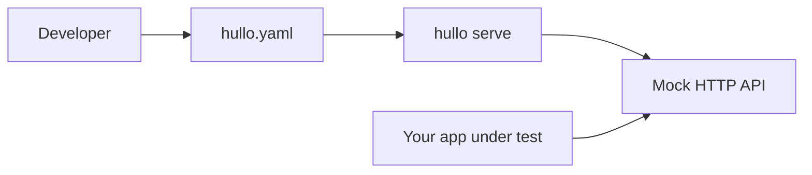

# Introduction

Hullo is a small command-line tool that spins up a mock HTTP API on your machine. You describe endpoints in a single `hullo.yaml` file — paths, methods, status codes, response bodies, and optional latency — and Hullo serves them instantly, reloading whenever the file changes.

It is useful when the real backend does not exist yet, is flaky, or is too slow to develop against.

## How it fits together




Hullo never calls production systems. It only serves what you declare in YAML, which makes it safe for offline and CI environments.

## Why Hullo

- **One file, no code.** Routes are plain YAML; there is nothing to compile or install per project.
- **Instant reload.** Edit `hullo.yaml` and the running server picks up the change without a restart.
- **Deterministic responses.** Fixed bodies and status codes keep frontend tests stable.
- **Simulated latency.** Add per-route or global delays to exercise loading states and timeouts.

## A 30-second example

```bash
hullo init demo-api
cd demo-api
hullo serve
```

Then, from another terminal:

```bash
curl http://localhost:4200/hello
# {"message":"Hello from Hullo!"}
```

## Where to go next

- [Installation](/installation) — install Hullo with npm, Homebrew, or a standalone binary.
- [Quickstart](/quickstart) — create a project and add your first custom route.
- [Commands](/commands) — reference for every `hullo` subcommand and flag.
- [Configuration](/configuration) — the full `hullo.yaml` schema.

<!-- include: auth-note.md -->

<!-- include: support-footer.md -->
